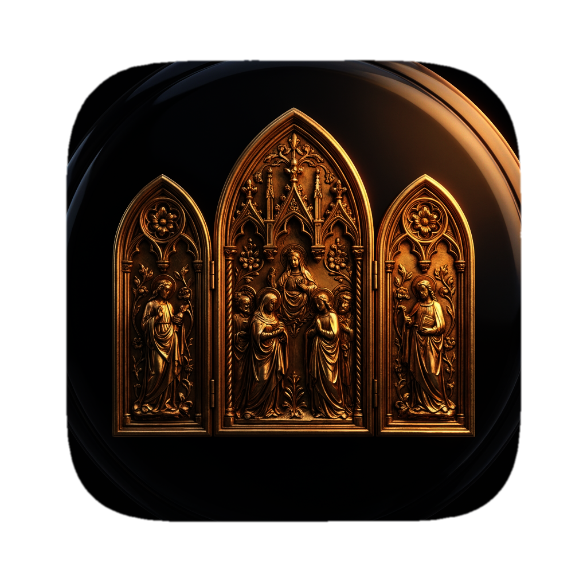

<p align="center"></p>

# Triptych

*Three panels, one altarpiece — a 3-band multiband compressor for dense mixes.*

[](https://github.com/basilica-audio/triptych/actions/workflows/ci.yml)
[](https://www.gnu.org/licenses/agpl-3.0)

> **Work in progress.** Triptych is pre-1.0 and under active development. There are no built binaries or releases yet — building from source is currently the only way to run it. Expect breaking changes until v1.0.0 ships (see [Roadmap](#roadmap)).

<!-- ==BEGIN BODY== (plugin engineer: replace this block with What it is / Features / Signal flow / Roadmap) -->
## What it is

Triptych is a 3-band multiband compressor built on JUCE 8, aimed at taming dense symphonic-metal mixes: two cascaded 4th-order Linkwitz-Riley (LR4) crossovers split the signal into Low/Mid/High bands, each with its own independent threshold/ratio/attack/release/makeup compressor and Mute/Solo, before the three bands are gated and summed back together and trimmed by a master output stage. The High band can additionally engage a brickwall-style limiter. The LR4 crossover's defining property - a magnitude-flat low+high sum - means that with every band's compressor disabled, Triptych is an exact, bit-identical passthrough of the input. See [`docs/manual.md`](docs/manual.md) for the full user manual.

## Features (v0.1.0 scope)

- **Low/Mid Split** and **Mid/High Split** - crossover points, 40 Hz - 1 kHz and 400 Hz - 12 kHz respectively, with a minimum runtime separation so automation can never invert band order
- **Per-band compression** (Low/Mid/High), each with:
  - **Threshold** - -60 to 0 dB
  - **Ratio** - 1:1 (bypass) to 20:1
  - **Attack** - 0.1 - 100 ms
  - **Release** - 10 - 1000 ms
  - **Makeup** - -12 to +24 dB
- **Per-band Mute/Solo** (Low/Mid/High) - console-style semantics: Mute always wins, soloing isolates the soloed band(s) while their compressor keeps running underneath (no re-attack pop on unmute)
- **High-band limiter option** - an optional brickwall-style `juce::dsp::Limiter` stage after the High band's compressor, threshold -24 to 0 dB (default -3 dB), guaranteeing the High band never exceeds 0 dBFS once engaged
- **Output** - master trim after the three (gated) bands are summed, -24 to +24 dB
- **Zero added latency** - the LR4 crossovers, `juce::dsp::Compressor`'s envelope follower, and the optional High-band limiter are all minimum-phase/causal with no lookahead, so no dry-path delay compensation is needed anywhere in the plugin
- Full state save/recall via `AudioProcessorValueTreeState`

## Signal flow

```
                    +-> BandComp (Low)  --------------------------------+
Input --> LR4 @ Low/Mid Split             |                             |
                    \-> LR4 @ Mid/High Split                            |
                              +-> BandComp (Mid)  ----------------------+--> Mute/Solo gate --> Sum --> Output --> Out
                              \-> BandComp (High) + optional Limiter ---+
```

See [`docs/architecture.md`](docs/architecture.md) for the full breakdown, including the flat-sum crossover property, the compressor bypass identity, the High-band limiter's behaviour, Mute/Solo semantics, and parameter smoothing.

## Roadmap

| Milestone | Description | Status |
|---|---|---|
| M0 | Bootstrap - project skeleton, CI, docs | Done |
| M1 | DSP completion & test coverage - per-band Mute/Solo, High-band limiter, broadened Catch2 suite | Done (external sidechain and adjustable crossover slopes deliberately deferred - see [`docs/architecture.md`](docs/architecture.md#deferred-from-m1-external-sidechain-and-adjustable-crossover-slopes)) |
| M2 | Presets & state recall | Planned |
| M3 | Custom GUI & accessibility | Planned |
| M4 | Release engineering - signing, notarization, installers, v1.0.0 | Planned |
<!-- ==END BODY== -->

## Installation

No pre-built binaries are published yet (see the work-in-progress notice above). Once releases begin, installation will follow the standard plugin locations:

**macOS**

| Format | Path |
|---|---|
| AU (Component) | `~/Library/Audio/Plug-Ins/Components/` |
| VST3 | `~/Library/Audio/Plug-Ins/VST3/` |

If Logic Pro doesn't pick up the plugin after installing, force a rescan by resetting the AU cache:

```sh
killall -9 AudioComponentRegistrar
auval -a
```

**Windows**

| Format | Path |
|---|---|
| VST3 | `C:\Program Files\Common Files\VST3\` |

## Building from source

Requires JUCE 8.0.14, C++20, and CMake ≥ 3.24. See [`docs/building.md`](docs/building.md) for full prerequisites and step-by-step build/test commands for macOS and Windows.

```sh
cmake -B build -G Ninja -DCMAKE_BUILD_TYPE=Release
cmake --build build
ctest --test-dir build --output-on-failure
```

## License

Triptych is licensed under the [GNU Affero General Public License v3.0](LICENSE) (AGPLv3).

This project uses [JUCE](https://juce.com) 8, whose open-source tier is licensed under AGPLv3 (as of JUCE 8; JUCE 7 and earlier used GPLv3), which is why this project is AGPLv3 rather than GPLv3. See [`docs/adr/0002-agplv3-licensing.md`](docs/adr/0002-agplv3-licensing.md) for the full reasoning.

VST is a registered trademark of Steinberg Media Technologies GmbH.

Triptych is an independent open-source project and is not affiliated with, endorsed by, or sponsored by any plugin manufacturer.
