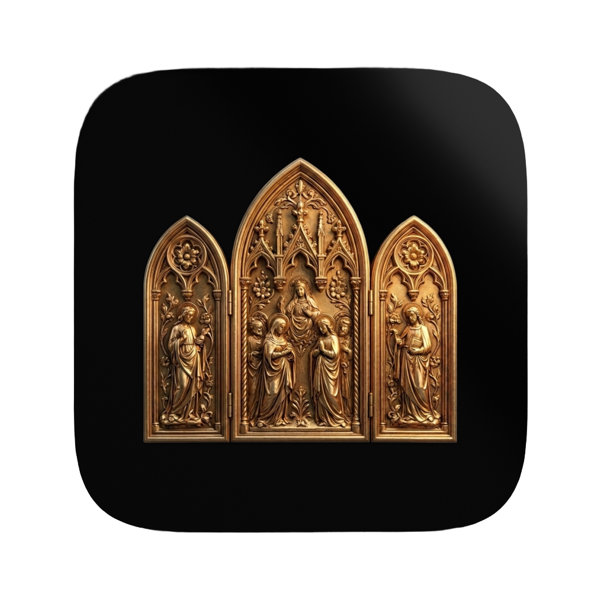

<p align="center"></p>

# Triptych

*Three panels, one altarpiece — a 3-band multiband compressor for dense mixes.*

[](https://github.com/basilica-audio/triptych/actions/workflows/ci.yml)
[](https://www.gnu.org/licenses/agpl-3.0)

> **Work in progress.** Triptych is pre-1.0 and under active development. Binaries for macOS and Windows are available from the [Releases](../../releases) page (macOS builds are signed with a Developer ID certificate, notarized and stapled); building from source works too. Expect breaking changes until v1.0.0 ships (see [Roadmap](#roadmap)).

<!-- ==BEGIN BODY== (plugin engineer: replace this block with What it is / Features / Signal flow / Roadmap) -->
## What it is

Triptych is a 3-band multiband compressor built on JUCE 8, aimed at taming dense, heavy mixes: two cascaded 4th-order Linkwitz-Riley (LR4) crossovers split the signal into Low/Mid/High bands, each with its own independent threshold/ratio/knee/attack/release/makeup compressor and Mute/Solo, before the three bands are gated and summed back together and trimmed by a master output stage. The High band can additionally engage a brickwall-style limiter. The LR4 crossover's defining property - a magnitude-flat low+high sum - means that with every band's compressor disabled, Triptych is an exact, bit-identical passthrough of the input. See [`docs/manual.md`](docs/manual.md) for the full user manual.

## Features

- **Low/Mid Split** and **Mid/High Split** - crossover points, 40 Hz - 1 kHz and 400 Hz - 12 kHz respectively, with a minimum runtime separation so automation can never invert band order
- **Crossover Slope** - 12, 24 (Linkwitz-Riley, default) or 48 dB/octave, shared by both crossover points
- **Per-band compression** (Low/Mid/High), each with:
  - **Threshold** - -60 to 0 dB (per-band defaults: Low -24, Mid -30, High -20)
  - **Ratio** - 1:5 (upward expansion) through 1:1 (exact bypass) to 20:1 (downward compression) (per-band defaults: Low 2.5:1, Mid 1.8:1, High 2:1)
  - **Knee** - 0-100%, default 50%, threshold-relative soft-knee transition (0% is an exact hard knee)
  - **Attack** - 0.1 - 100 ms (per-band defaults: Low 25, Mid 10, High 5)
  - **Release** - 10 - 1000 ms (per-band defaults: Low 180, Mid 100, High 55)
  - **Makeup** - -12 to +24 dB
  - **Detector** - Peak or RMS envelope detection, default Peak
  - **Auto Release** - programme-dependent release, off by default
  - **Character** - Clean or VCA gain-computer voicing, default Clean
  - **Stereo Link** - 0-100%, default 0%
- **Per-band Range** (optional, Low/Mid/High) - clamps the maximum gain change, cut or boost, a band's compressor can apply, 0-30 dB, off by default (12 dB once engaged)
- **Per-band Mid/Side processing** (optional, Low/Mid/High) - compresses the Side signal independently, with its own Threshold (same range and default as the band's main Threshold) and Ratio (1:5 to 20:1, default 1:1 bypass)
- **Per-band Mute/Solo** (Low/Mid/High) - console-style semantics: Mute always wins, soloing isolates the soloed band(s) while their compressor keeps running underneath (no re-attack pop on unmute)
- **Per-band downward expansion / Gate** (optional, Low/Mid/High), each with:
  - **Threshold** - -80 to 0 dB (per-band defaults: Low -50, Mid -55, High -45)
  - **Ratio** - 1:1 (bypass) to 100:1, default 2:1
  - **Attack** - 0.1 - 50 ms (per-band defaults: Low 10, Mid 5, High 2)
  - **Release** - 10 - 2000 ms (per-band defaults: Low 200, Mid 150, High 100)
  - **Gate Hold** - 0-500 ms, default 0 ms
  - **Gate Hysteresis** - 0-12 dB of separation between the opening and closing thresholds, default 0 dB
- **High-band limiter option** - an optional brickwall-style `juce::dsp::Limiter` stage after the High band's compressor, threshold -24 to 0 dB (default -3 dB), guaranteeing the High band never exceeds 0 dBFS once engaged
- **Sidechain** - **Source** switches the detectors between the plugin's own signal (Internal, default) and an external sidechain feed; **Listen** solos a band's detector-key signal (Off/Low/Mid/High, default Off) so it can be monitored directly
- **Lookahead** - Off (default), 1.5, 3 or 5 ms, reported to the host as plugin latency
- **Mix** - global dry/wet, 0-100%, default 100% (fully wet)
- **Output** - master trim after the three (gated) bands are summed, -24 to +24 dB
- **Zero added latency by default** - the crossovers, the envelope followers driving the per-band gain computers, and the optional High-band limiter are all minimum-phase/causal with no lookahead of their own; the only source of added latency is the Lookahead control above, which is off by default
- **Nine factory presets** plus a full preset system (save/load, import/export, banks, default) - see [`docs/presets.md`](docs/presets.md)
- German localisation of the preset bar's interface text
- Full state save/recall via `AudioProcessorValueTreeState`, tolerant of pre-v0.2.0 saved sessions

## Signal flow

```
                    +-> BandComp (Low)  --------------------------------+
Input --> LR4 @ Low/Mid Split             |                             |
                    \-> LR4 @ Mid/High Split                            |
                              +-> BandComp (Mid)  ----------------------+--> Mute/Solo gate --> Sum --> Output --> Out
                              \-> BandComp (High) + optional Limiter ---+
```

See [`docs/architecture.md`](docs/architecture.md) for the full breakdown, including the flat-sum crossover property, the compressor bypass identity, the High-band limiter's behaviour, Mute/Solo semantics, and parameter smoothing.

## Roadmap

| Milestone | Description | Status |
|---|---|---|
| M0 | Bootstrap - project skeleton, CI, docs | Done |
| M1 | DSP completion & test coverage - per-band Mute/Solo, High-band limiter, broadened Catch2 suite | Done (external sidechain and adjustable crossover slopes deliberately deferred - see [`docs/architecture.md`](docs/architecture.md#deferred-from-m1-external-sidechain-and-adjustable-crossover-slopes)) |
| M2 | Presets & state recall - research-derived deep-dive rework (soft knee, per-band defaults), eight factory presets, German i18n frame | Done (per-band M/S, RMS detector mode, and program-dependent release deliberately deferred - see [`docs/architecture.md`](docs/architecture.md#deferred-from-v020-ms-processing-rms-detector-mode-program-dependent-release)) |
| M3 | Custom GUI & accessibility | Planned |
| M4 | Release engineering - signing, notarization, installers, v1.0.0 | Planned |
<!-- ==END BODY== -->

## Documentation

- [`docs/manual.md`](docs/manual.md) — the user manual: what every control does, and how to use it
- [`docs/presets.md`](docs/presets.md) — what each factory preset is for
- [`CHANGELOG.md`](CHANGELOG.md) — what shipped in each release
- [Triptych on basilica-audio.github.io](https://basilica-audio.github.io/website/triptych/) — the product page (English and German)

## Installation

Download the archive for your platform from the [Releases](../../releases) page and copy the bundles into the standard plugin locations:

**macOS**

| Format | Path |
|---|---|
| AU (Component) | `~/Library/Audio/Plug-Ins/Components/` |
| VST3 | `~/Library/Audio/Plug-Ins/VST3/` |

If Logic Pro doesn't pick up the plugin after installing, force a rescan by resetting the AU cache:

```sh
killall -9 AudioComponentRegistrar
auval -a
```

**Windows**

| Format | Path |
|---|---|
| VST3 | `C:\Program Files\Common Files\VST3\` |

## Building from source

Requires JUCE 8.0.14, C++20, and CMake ≥ 3.24. See [`docs/building.md`](docs/building.md) for full prerequisites and step-by-step build/test commands for macOS and Windows.

```sh
cmake -B build -G Ninja -DCMAKE_BUILD_TYPE=Release
cmake --build build
ctest --test-dir build --output-on-failure
```

## License

Triptych is licensed under the [GNU Affero General Public License v3.0](LICENSE) (AGPLv3).

This project uses [JUCE](https://juce.com) 8, whose open-source tier is licensed under AGPLv3 (as of JUCE 8; JUCE 7 and earlier used GPLv3), which is why this project is AGPLv3 rather than GPLv3. See [`docs/adr/0002-agplv3-licensing.md`](docs/adr/0002-agplv3-licensing.md) for the full reasoning.

VST is a registered trademark of Steinberg Media Technologies GmbH.

Triptych is an independent open-source project and is not affiliated with, endorsed by, or sponsored by any plugin manufacturer.
