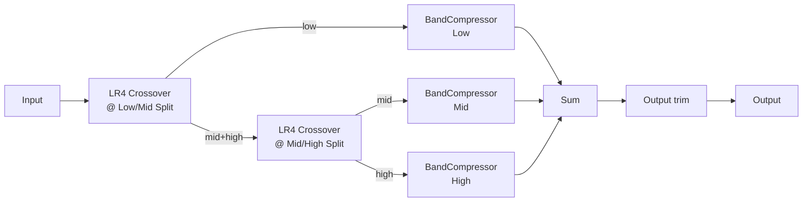

# Architecture

## Signal flow

Two cascaded 4th-order Linkwitz-Riley (LR4) crossovers split the input into three bands. The first splits Low from the remainder at **Low/Mid Split**; the second splits that remainder into Mid and High at **Mid/High Split**. Each band runs through its own `BandCompressor` (threshold/ratio/attack/release + makeup), and the three processed bands are summed back together before a final master **Output** trim. All of this lives in `TriptychEngine` (`src/dsp/TriptychEngine.{h,cpp}`).

## Module map

| Directory | Responsibility |
|---|---|
| `src/dsp` | All audio-thread DSP: `Crossover` (the LR4 wrapper, cascaded twice), `BandCompressor` (per-band threshold/ratio/attack/release/makeup), and `TriptychEngine` (the full 3-band signal chain: crossover cascade, three `BandCompressor`s, sum, output trim). No allocation, locks, or I/O once `prepare()` has run. Independent of `juce::AudioProcessor` so it is directly unit-testable (see `tests/CrossoverTests.cpp`, `tests/BandCompressorTests.cpp`, `tests/EngineTests.cpp`). |
| `src/params` | Parameter layout and `AudioProcessorValueTreeState` definitions - parameter IDs, ranges, defaults. Single source of truth for what a preset captures. |
| `src/PluginProcessor.*` | Host plumbing: APVTS construction, `prepareToPlay`/`processBlock`/`reset`, latency reporting, state save/load. Reads APVTS values and pushes them into `TriptychEngine` every block; does not implement any DSP itself. |
| `src/PluginEditor.*` | A simple, functional v0.1 GUI: a top strip of Low/Mid Split, Mid/High Split and Output knobs, above three per-band columns (Low/Mid/High), each with Threshold/Ratio/Attack/Release/Makeup knobs bound via `SliderAttachment`. A custom vector-drawn GUI is a later milestone. |

Dependency direction is one-way: `PluginEditor` -> `params` (via attachments) and `PluginProcessor` -> `params` + `dsp`. `src/dsp` has no upward dependency on the processor or UI, which is what keeps `TriptychEngine` testable in isolation.

## The crossover cascade and its flat-sum property

`Crossover` (`src/dsp/Crossover.{h,cpp}`) wraps a single `juce::dsp::LinkwitzRileyFilter<float>` and uses its dual-output `processSample(channel, input, outputLow, outputHigh)` overload, which runs one cascaded TPT (topology-preserving transform) state per channel and emits matched low/high outputs from that shared state. Per JUCE's own documentation, this construction guarantees that `outputLow + outputHigh` reconstructs the input with a flat magnitude frequency response (the classic LR4 crossover property) - unlike two independently configured lowpass/highpass filters, which would leave a notch or bump at the crossover point.

`TriptychEngine` cascades two `Crossover` instances:

1. The first splits the input into **Low** and a **Mid+High** remainder at `lowMidSplitHz`.
2. The second splits that remainder into **Mid** and **High** at `midHighSplitHz`.

Because each stage's own low+high sum is flat, the cascade's Low+Mid+High sum is flat too. `TriptychEngine` enforces a minimum runtime separation (`minimumSplitSeparationHz`, 20 Hz) between the two split frequencies so automation can never push the Mid/High split at or below the Low/Mid split, which would invert band order and momentarily break this property.

**Important nuance verified by `tests/EngineTests.cpp`:** the LR4 low+high sum is magnitude-flat but is an *all-pass*, not a pure identity/delay - it has its own real, frequency-dependent phase response (compounded further by cascading two stages). A steady-state single-tone null test therefore has to allow for that phase shift (equivalent, for one frequency, to a small time shift) via a correlation search over a modest alignment window, rather than asserting a raw zero-shift per-sample match. The RMS-level (magnitude-only) null test does not need this accommodation and is the primary flat-sum acceptance gate, matching `tests/CrossoverTests.cpp`'s single-stage version of the same check.

## Per-band compression and the bypass identity

`BandCompressor` (`src/dsp/BandCompressor.{h,cpp}`) wraps `juce::dsp::Compressor<float>` (feed-forward VCA compression driven by a causal ballistics-filter envelope follower) followed by `juce::dsp::Gain<float>` for makeup gain.

`juce::dsp::Compressor::processSample` computes `gain = (env < threshold) ? 1.0 : pow(env * thresholdInverse, ratioInverse - 1.0)`. With `ratio == 1.0`, `ratioInverse - 1.0 == 0`, so `gain == 1.0` unconditionally - independent of threshold or the envelope value. Setting `ratio = 1.0` and `makeup = 0 dB` therefore makes a band an exact, bit-identical bypass of its VCA stage, regardless of what its threshold/attack/release happen to be set to. `TriptychEngine`'s flat-sum null test (`tests/EngineTests.cpp`) relies on exactly this: bypassing all three bands this way isolates the crossover cascade's own flat-sum property from any interaction with actual compression.

Threshold and ratio are smoothed (`juce::SmoothedValue`, linear) and re-applied once per block rather than per sample - `juce::dsp::Compressor` has no ramp of its own for these, so an unsmoothed jump (e.g. a fast GUI drag) would otherwise produce an audible, instantaneous step in the VCA gain curve. This is the same block-rate-recompute compromise used for the crossover split frequencies below. Attack and Release are the envelope follower's own time constants, not audio-rate gain values, so they are applied directly (matching `juce::dsp::Compressor`'s own `setAttack`/`setRelease`, which recompute synchronously).

## Latency

Both the LR4 crossovers (minimum-phase IIR, no lookahead) and `juce::dsp::Compressor` (a causal envelope follower with no lookahead) add zero latency. `TriptychEngine::getLatencySamples()` is therefore a `static constexpr` `0`, and `TriptychAudioProcessor::prepareToPlay()` reports that via `setLatencySamples(0)`. There is no dry-path delay compensation anywhere in this plugin, unlike, e.g. Overture's oversampled clipper - see `tests/LatencyTests.cpp`.

## Parameter smoothing

- **Low/Mid Split** and **Mid/High Split** are crossover cutoff frequencies. Recomputing `LinkwitzRileyFilter` coefficients involves a `tan()` call, so these are not cheap to interpolate per sample; each is smoothed with a `juce::SmoothedValue<float, ValueSmoothingTypes::Multiplicative>` (frequencies are perceived logarithmically) and the cutoff is recomputed once per block from the smoothed value, with the minimum-separation clamp applied after smoothing (see above).
- **Threshold** and **Ratio** (per band) are smoothed the same way (linear smoothing) and re-applied once per block, as described above.
- **Attack**, **Release** are applied directly to `juce::dsp::Compressor`, matching its own synchronous `setAttack`/`setRelease` design.
- **Makeup** (per band) and **Output** (master) are plain gain stages (`juce::dsp::Gain<float>`), which ramp sample-accurately via their own internal `SmoothedValue` (`setRampDurationSeconds`).
- All smoothers are seeded to their real starting value in `prepare()` (`lastLowMidSplitHz`/`lastMidHighSplitHz` in `TriptychEngine`, `lastThresholdDb`/`lastRatio` in `BandCompressor`), so re-preparing (sample-rate change, etc.) never resets a live parameter back to a built-in default or lets a smoother ramp from an invalid starting point (e.g. 0 Hz, or a ratio below the `juce::dsp::Compressor::setRatio` contract of `>= 1.0`).

## Real-time safety

- `TriptychAudioProcessor::processBlock()` starts with `juce::ScopedNoDenormals`.
- All DSP state (crossover filters, compressor envelope followers, gain ramps, and the four intermediate per-band `AudioBuffer`s) is allocated in `prepare()`/`prepareToPlay()` and never reallocated on the audio thread.
- `reset()` clears all filter/envelope/gain-ramp state without deallocating (`TriptychEngine::reset()`, called from both `AudioProcessor::reset()` and internally from `prepare()`).
- Parameter values are read via `apvts.getRawParameterValue()` atomics in `processBlock()`, never via `apvts.getParameter()->getValue()` (not guaranteed lock/allocation-free) and never via `String`-keyed lookups on the audio thread.
- `TriptychEngine::process()` treats a zero-sample block as a safe no-op, and defensively clamps to the per-band buffer capacity established in `prepare()` if a host ever calls `process()` with more samples or channels than it promised via `prepareToPlay()` (`tests/RobustnessTests.cpp` exercises this).
- Crossover cutoff frequencies are clamped below Nyquist (`clampBelowNyquist`, in `TriptychEngine.cpp`) as defensive insurance against invalid `LinkwitzRileyFilter` coefficients at unusually low sample rates, and the Mid/High split is always clamped at least `minimumSplitSeparationHz` above the (possibly still-ramping) Low/Mid split so the two crossovers can never invert order mid-automation.
